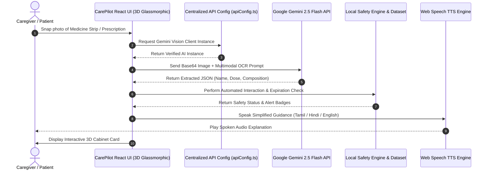

<div align="center">

  <!-- Animated Header Banner -->
  <a href="https://github.com/Hem-Hemnath/Care_Pilot">
    
  </a>

  <p align="center">
    <strong>Empowering Family Caregivers & Patients with Instant AI Vision OCR, Safety Verification, Multilingual Voice Guidance, and Interactive 3D Cabinet Management.</strong>
  </p>

  <p align="center">
    <a href="#-key-features">Key Features</a> •
    <a href="#-tech-stack--architecture">Tech Stack</a> •
    <a href="#-quick-start">Quick Start</a> •
    <a href="#-android-apk-build">Android App</a> •
    <a href="#-medical-disclaimer">Safety Disclaimer</a>
  </p>

  <!-- Animated Status Badges -->
  <p align="center">
    
    
    
    
    
    
  </p>

</div>

---

## 🌟 Overview

**CarePilot** is an open-source, AI-powered healthcare assistant designed for family caregivers managing complex daily medication for elderly dependents or patients with chronic illnesses. Built during the **GDG Coimbatore - Build with AI: Code for Communities Hackathon 2026** (GRD College & TiE Kovai Con), CarePilot addresses SDG Track 3: *Good Health & Well-being*.

Caregivers often struggle to read small, blurry text on medicine strips or understand complex pharmaceutical compositions. CarePilot allows users to take a photo of any medicine strip, packaging box, or prescription document, instant-identifying active ingredients, dosage schedules, precautions, and safety alerts in **Tamil, Hindi, or English** within seconds.

---

## ✨ Key Features

| Feature | Description |
| :--- | :--- |
| 📸 **AI Vision OCR Scanner** | Analyzes medicine labels, blister strips, or handwritten prescriptions using Gemini 2.5 Flash Vision AI to extract names, composition, and dosage instructions. |
| 🛡️ **Automated Safety Shield** | Cross-checks newly added medicines against existing patient records for drug-drug interactions, duplicate treatments, or stock expiration risks. |
| 🎙️ **Multilingual Voice AI** | Built-in Speech-to-Text (STT) and Text-to-Speech (TTS) engine providing spoken answers and advice in regional Indian languages (Tamil, Hindi, English). |
| 🧊 **3D Interactive Forms & Cabinet** | Sleek, dark-mode 3D perspective elements with real-time `translateZ` hover tilt depth animations and glow halos. |
| 👥 **Dual Caregiver & Patient Modes** | Tailored interface for caregivers managing multiple patient profiles or simplified touch-and-talk controls for elderly patients. |
| 💊 **Digital Cabinet Tracker** | Real-time dosage checklist, low-stock notifications, dose logs, and medicine comparator tool to verify strips against prescriptions. |
| 📱 **Cross-Platform Readiness** | Mobile-first responsive PWA and native Android app container via Capacitor. |

---

## 🛠️ Tech Stack & Architecture

### Core Technologies
- **Frontend Framework**: React 19 (Hooks, Context API)
- **Type Safety**: TypeScript 5.0
- **Build System**: Vite 8
- **AI Integration**: `@google/generative-ai` (Gemini 2.5 Flash Multimodal API)
- **Styling & 3D System**: Vanilla CSS Variables, Tailwind Utility Tokens, CSS 3D Perspective (`perspective: 1200px`, `preserve-3d`)
- **Voice Engine**: Web Speech API (`webkitSpeechRecognition` & `window.speechSynthesis`)
- **Database & Auth**: Firebase Firestore & Auth (with fallback offline mock service)
- **Mobile Container**: Capacitor 7 (Android SDK)

### High-Level Data Flow



---

## 🚀 Quick Start

### Prerequisites
- **Node.js**: `v18.0.0` or higher
- **npm**: `v9.0.0` or higher
- **Google Gemini API Key**: Get a free API key at [Google AI Studio](https://aistudio.google.com/)

### 1. Clone the Repository
```bash
git clone https://github.com/Hem-Hemnath/Care_Pilot.git
cd Care_Pilot
```

### 2. Install Dependencies
```bash
npm install
```

### 3. Configure Environment Variables
Copy the `.env.example` file to create a local `.env` configuration:
```bash
cp .env.example .env
```
Open `.env` and add your Gemini API Key:
```env
VITE_GEMINI_API_KEY=your_actual_gemini_api_key_here
```

### 4. Start Development Server
```bash
npm run dev
```
Open your browser and navigate to `http://localhost:5173`.

---

## 📱 Android APK Build (Capacitor)

CarePilot is packaged for Android devices using Capacitor.

```bash
# 1. Build production static bundle
npm run build

# 2. Add Android platform (first time only)
npx cap add android

# 3. Sync web assets with Android native project
npx cap sync android

# 4. Open in Android Studio to build APK
npx cap open android
```

---

## ⚕️ Medical Disclaimer

> [!IMPORTANT]
> **CarePilot AI provides informational guidance only.**
> CarePilot is designed to assist family caregivers and patients in identifying medicine packaging details and managing schedules. It does **not** provide medical diagnosis, prescribe treatments, recommend dosage adjustments, or replace professional advice from registered medical practitioners, doctors, or pharmacists.

---

## 🏆 Team Avengers (TEAM-102)

Developed for **Tech for Good 2026 — Build with AI: Code for Communities** (GDG Coimbatore).

| Teammate | GitHub Profile |
| :--- | :--- |
| **Hemnath** | [@Hem-hemnath](https://github.com/Hem-hemnath) |
| **Srinath** | [@Srinathsenthilkumar](https://github.com/Srinathsenthilkumar) |
| **Sarugeshwaran** | [@sarugeshwaran](https://github.com/sarugeshwaran) |
| **Myvilikannan** | [@myvilikannan-007](https://github.com/myvilikannan-007) |

<br />

<div align="center">
  <sub>Built with ❤️ by Team Avengers for GDG Coimbatore · GRD College · TiE Kovai Con</sub>
</div>
